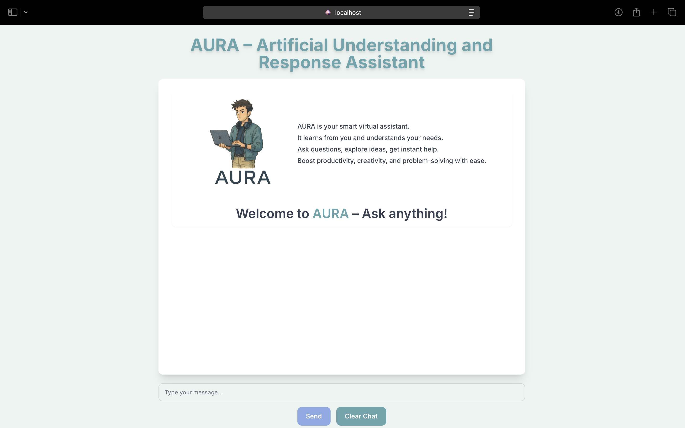

# AURA – Artificial Understanding and Response Assistant

AURA is a smart virtual assistant that uses AI to understand and respond to user queries. It helps users by boosting productivity, creativity, and problem-solving through seamless interaction. With the ability to learn from the user and adapt to their needs, AURA provides instant help for any questions or ideas you want to explore.

Website link: https://aura-assist.netlify.app

## Demo


▶️[Watch Demo Video](https://drive.google.com/file/d/1e-oPzRxVrT8csOP0e0ZZtNejlu0PGtHA/view?usp=sharing)

---

### Tech Stack

The AURA app was developed using the following technologies:

- **Frontend**:

  - **React**: A JavaScript library used for building the user interface. React allows for the creation of interactive UI components with efficient rendering.
  - **CSS**: Custom styling for a clean and modern design.
  - **React Markdown**: For rendering markdown-formatted text responses in the chat history.

- **Backend**:

  - **Google Generative AI**: The app integrates Google's Gemini 1.5 AI model, which powers the AI-based responses to user inputs.
  - **Google Generative AI API**: Used for processing the user's messages and generating intelligent responses.

- **Others**:
  - **Tailwind CSS**: Utility-first CSS framework used for responsive design and layout adjustments.

---

#### AI Integration with Gemini API

AURA leverages the **Google Gemini AI API** to generate intelligent responses. By making requests to the Gemini model, the application is able to generate content based on the user’s input. This allows AURA to provide detailed answers, recommendations, and assist with tasks.

The following steps were implemented to integrate Gemini AI:

1. **API Integration**: Connected to the Gemini API using a unique API key.
2. **Requesting AI Responses**: For each user message, a request is sent to the Gemini model, which then generates a response.
3. **Displaying Results**: The response from Gemini AI is displayed in the chat interface as the AI’s message.

---

##### Features

- **User Interaction**: Users can type messages and receive responses from the AI assistant.
- **Chat History**: Every message sent and received is stored in the chat history for context.
- **Clear Chat**: Users have the ability to clear the chat history.
- **Responsive UI**: The design is fully responsive, ensuring a smooth user experience across different devices.

---

###### Installation

To run the project locally, follow these steps:

1. Clone the repository:
   ```bash
   git clone <repository_url>
   ```
2. Navigate to the project folder:
   ```bash
   npm install
   ```
3. Install the required dependencies:
   ```bash
   npm start
   ```

The app should now be running on http://localhost:3000.
